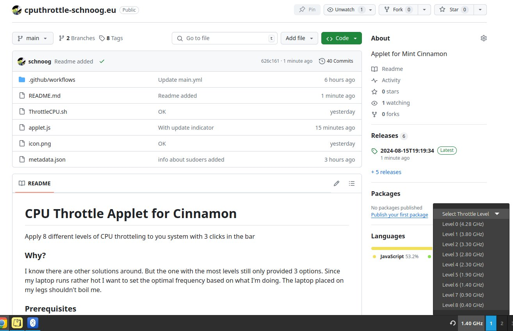

# CPU Throttle Applet for Cinnamon

Apply 8 (by default, you can modify that) different levels of CPU throttling to you system with 3 clicks in the bar.

### Why?
I know there are other solutions around. But the one with the most levels still only provided 3 options. Since my laptop runs rather hot I want to set the optimal frequency based on what I'm doing. The laptop placed on my legs shouldn't boil me.

### Prerequisites

You need a system running cinnamon desktop environment (I use Mint)

You need to have cpufrequtils installed 

You user needs to have the right to use sudo

You need to setup sudo so that cpufreq-set without password prompt.

To do so use visudo and add the following line 

ALL ALL=NOPASSWD: /usr/bin/cpufreq-set

### Principle

Each CPU announces its max and min frequency. The script included executes cpufreq-info 
to gather this information as well as the number of cores the CPU provides.

The range between min and max frequency is then divided through 8 which gives the stepwidth between the different CPU Throtteling level. All frequencies but min and max are rounded.

This data is made available to the applet, which display these different levels as options in a drop down menue. If an option is selected the new frequency is applied using cpufreq-set.

Shortly afterwards the frequency display of the applet if updated to the current value

### Installation

Download the release zip (each push creates a new one automatically) and extract the directory contained into your 

~/.local/share/cinnamon/applets/

directory 

### Settings

This applet has 2 settings: 

1) Number of throttling steps. Not-throttled (0)......... X = Min CPU frequency

2) Default throttling step to set after the appled is launched (normally at reboot for example)

